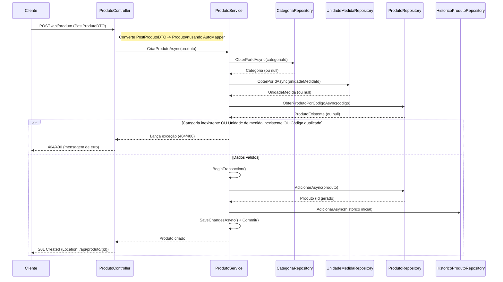

```mermaid
sequenceDiagram
    participant Client as Cliente
    participant Controller as ProdutoController
    participant Service as ProdutoService
    participant CatRepo as CategoriaRepository
    participant UMRepo as UnidadeMedidaRepository
    participant ProdRepo as ProdutoRepository
    participant HistRepo as HistoricoProdutoRepository

    Client->>Controller: POST /api/produto (PostProdutoDTO)
    note right of Controller: Converte PostProdutoDTO -> Produto\nusando AutoMapper
    Controller->>Service: CriarProdutoAsync(produto)

    Service->>CatRepo: ObterPorIdAsync(categoriaId)
    CatRepo-->>Service: Categoria (ou null)

    Service->>UMRepo: ObterPorIdAsync(unidadeMedidaId)
    UMRepo-->>Service: UnidadeMedida (ou null)

    Service->>ProdRepo: ObterProdutoPorCodigoAsync(codigo)
    ProdRepo-->>Service: ProdutoExistente (ou null)

    alt Categoria inexistente OU Unidade de medida inexistente OU Código duplicado
        Service-->>Controller: Lança exceção (404/400)
        Controller-->>Client: 404/400 (mensagem de erro)
    else Dados válidos
        Service->>Service: BeginTransaction()
        Service->>ProdRepo: AdicionarAsync(produto)
        ProdRepo-->>Service: Produto (Id gerado)
        Service->>HistRepo: AdicionarAsync(historico inicial)
        Service->>Service: SaveChangesAsync() + Commit()
        Service-->>Controller: Produto criado
        Controller-->>Client: 201 Created (Location: /api/produto/{id})
    end
```