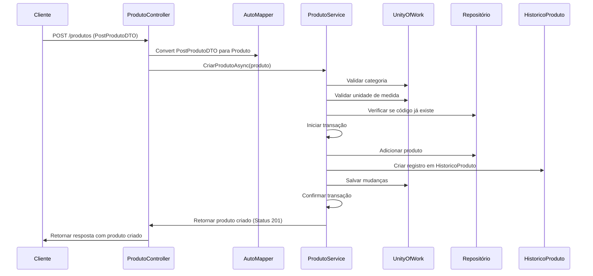

```mermaid
sequenceDiagram
    participant Client as Cliente
    participant Controller as ProdutoController
    participant Mapper as AutoMapper
    participant Service as ProdutoService
    participant UoW as UnityOfWork
    participant Repo as Repositório
    participant Historico as HistoricoProduto

    Client->>Controller: POST /produtos (PostProdutoDTO)
    Controller->>Mapper: Convert PostProdutoDTO para Produto
    Controller->>Service: CriarProdutoAsync(produto)
    Service->>UoW: Validar categoria
    Service->>UoW: Validar unidade de medida
    Service->>Repo: Verificar se código já existe
    Service->>Service: Iniciar transação
    Service->>Repo: Adicionar produto
    Service->>Historico: Criar registro em HistoricoProduto
    Service->>UoW: Salvar mudanças
    Service->>Service: Confirmar transação
    Service->>Controller: Retornar produto criado (Status 201)
    Controller->>Client: Retornar resposta com produto criado
```